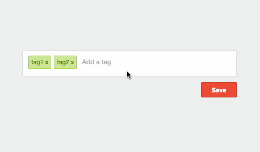

# react-tagsinput

[![NPM version][npm-image]][npm-url]
[![Build Status][travis-image]][travis-url]
[![Coverage Status][coverage-image]][coverage-url]
[![Dependency Status][dep-image]][dep-url]
[![Size][size-image]][size-url]
[![Download Count][downloads-image]][downloads-url]
[![js-standard-style][standard-image]][standard-url]

Highly customizable [React](http://facebook.github.io/react/index.html) component for inputing tags.

## Table of Contents

  * [react-tagsinput](#react-tagsinput)
    * [Demo](#demo)
    * [Install](#install)
    * [Example](#example)
    * [FAQ](#faq)
      * [How do I make the input dynamically grow in size?](#how-do-i-make-the-input-dynamically-grow-in-size)
      * [How do I add auto suggestion?](#how-do-i-add-auto-suggestion)
      * [How do I control the value of the input box?](#how-do-i-control-the-value-of-the-input-box)
      * [How do I fix warning "unknown prop `addTag`"?](#how-do-i-fix-warning-unknown-prop-addtag)
      * [How do I copy paste from Excel?](#how-do-i-copy-paste-from-excel)
    * [Component Interface](#component-interface)
      * [Props](#props)
        * [value (required)](#value-required)
        * [onChange (required)](#onchange-required)
        * [onChangeInput](#onchangeinput)
        * [addKeys](#addkeys)
        * [currentValue](#currentvalue)
        * [inputValue](#inputvalue)
        * [onlyUnique](#onlyunique)
        * [validationRegex](#validationregex)
        * [onValidationReject](#onvalidationreject)
        * [disabled](#disabled)
        * [maxTags](#maxtags)
        * [addOnBlur](#addonblur)
        * [addOnPaste](#addonpaste)
        * [pasteSplit](#pastesplit)
        * [removeKeys](#removekeys)
        * [tagProps](#tagprops)
        * [inputProps](#inputprops)
        * [renderTag](#rendertag)
        * [renderInput](#renderinput)
        * [renderLayout](#renderlayout)
        * [preventSubmit](#preventSubmit)
      * [Methods](#methods)
        * [focus()](#focus)
        * [blur()](#blur)
        * [accept()](#accept)
        * [addTag()](#addTag)
        * [clearInput()](#clearInput)
    * [Styling](#styling)
    * [Contributors](#contributors)
    * [Changelog](#changelog)
    * [License](#license)

## Demo

[][demo-url]

### [Interactive Demo](https://olahol.github.io/react-tagsinput)

## Install

```bash
npm install react-tagsinput --save
```

```bash
bower install react-tagsinput --save
```

## Example

```javascript
import TagsInput from 'react-tagsinput'

import 'react-tagsinput/react-tagsinput.css' // If using WebPack and style-loader.

class Example extends React.Component {
  constructor() {
    super()
    this.state = {tags: []}
  }

  handleChange(tags) {
    this.setState({tags})
  }

  render() {
    return <TagsInput value={this.state.tags} onChange={::this.handleChange} />
  }
}
```
## FAQ

##### How do I make the input dynamically grow in size?

Install [`react-input-autosize`](https://github.com/JedWatson/react-input-autosize) and change the `renderInput` prop to:

```js
function autosizingRenderInput ({addTag, ...props}) {
  let {onChange, value, ...other} = props
  return (
    <AutosizeInput type='text' onChange={onChange} value={value} {...other} />
  )
}
```

##### How do I add auto suggestion?

Use [`react-autosuggest`](https://github.com/moroshko/react-autosuggest) and change the `renderInput` prop to
something like:

```js
function autosuggestRenderInput ({addTag, ...props}) {
  const handleOnChange = (e, {newValue, method}) => {
    if (method === 'enter') {
      e.preventDefault()
    } else {
      props.onChange(e)
    }
  }

  const inputValue = (props.value && props.value.trim().toLowerCase()) || ''
  const inputLength = inputValue.length

  let suggestions = states().filter((state) => {
    return state.name.toLowerCase().slice(0, inputLength) === inputValue
  })

  return (
    <Autosuggest
      ref={props.ref}
      suggestions={suggestions}
      shouldRenderSuggestions={(value) => value && value.trim().length > 0}
      getSuggestionValue={(suggestion) => suggestion.name}
      renderSuggestion={(suggestion) => <span>{suggestion.name}</span>}
      inputProps={{...props, onChange: handleOnChange}}
      onSuggestionSelected={(e, {suggestion}) => {
        addTag(suggestion.name)
      }}
      onSuggestionsClearRequested={() => {}}
      onSuggestionsFetchRequested={() => {}}
    />
  )
}
```

A working example can be found in
[`example/components/autocomplete.js`](https://github.com/olahol/react-tagsinput/blob/master/example/components/autocomplete.js).

##### How do I control the value of the input box?

Use `inputValue` and `onChangeInput`:

```js
class Example extends React.Component {
  constructor() {
    super()
    this.state = {tags: [], tag: ''}
  }

  handleChange(tags) {
    this.setState({tags})
  }

  handleChangeInput(tag) {
    this.setState({tag})
  }

  render() {
    return (
      <TagsInput
        value={this.state.tags}
        onChange={::this.handleChange}
        inputValue={this.state.tag}
        onChangeInput={::this.handleChangeInput}
      />
    )
  }
}
```

##### How do I fix warning "unknown prop `addTag`"?

For ease of integration with auto complete components `react-tagsinput`
passes the `addTag` method to `renderInput` props, if you are writing your
own `renderInput` you need to filter `addTag` to not get an error about
`unknown prop addTag` from React. Here is how it's done in the default
`renderInput` function.

```js
function defaultRenderInput ({addTag, ...props}) {
  let {onChange, value, ...other} = props
  return (
    <input type='text' onChange={onChange} value={value} {...other} />
  )
}
```
##### How do I copy paste from Excel?

>All you need is to add a CR, carriage return, symbol (it is the default line break style in MS Office documents).

See [answer on Stack Overflow](http://stackoverflow.com/a/42008826/3276759).

Set the `pasteSplit` prop to this function:

```js
pasteSplit(data) {
  const separators = [',', ';', '\\(', '\\)', '\\*', '/', ':', '\\?', '\n', '\r'];
  return data.split(new RegExp(separators.join('|'))).map(d => d.trim());
}
```

## Component Interface

### Props

##### value (required)

An array of tags.

##### onChange (required)

Callback when tags change, gets three arguments `tags` which is the new
tag array, `changed` which is an array of the tags that have changed and
`changedIndexes` which is an array of the indexes that have changed.

##### onChangeInput

Callback from the input box, gets one argument `value` which is the content of the input box.
(onChangeInput is only called if the input box is [controlled](https://facebook.github.io/react/docs/forms.html#controlled-components), for this to happen both inputValue and onChangeInput need to be set)

##### addKeys

An array of key codes that add a tag, default is `[9, 13]` (Tab and Enter).

##### currentValue

A string to set a value on the input.

##### inputValue

Similar to `currentValue` but needed for controlling the input box. (inputValue is only useful if you use it together with onChangeInput)

##### onlyUnique

Allow only unique tags, default is `false`.

##### validationRegex

Allow only tags that pass this regex to be added. Default is `/.*/`.

##### onValidationReject

Callback when tags are rejected through validationRegex, passing array of tags as the argument.

##### disabled

Passes the disabled prop to `renderInput` and `renderTag`, by default this
will "disable" the component.

##### maxTags

Allow limit number of tags, default is `-1` for infinite.

##### addOnBlur

Add a tag if input blurs. Default false.

##### addOnPaste

Add a tags if HTML5 paste on input. Default false.

##### pasteSplit

Function that splits pasted text. Default is:

```javascript
function defaultPasteSplit (data) {
  return data.split(' ').map(d => d.trim())
}
```

##### removeKeys

An array of key codes that remove a tag, default is `[8]` (Backspace).


##### className

Specify the wrapper className. Default is `react-tagsinput`.


##### focusedClassName

Specify the class to add to the wrapper when the component is focused. Default is `react-tagsinput--focused`.


##### tagProps

Props passed down to every tag component. Default is: 
```javascript
{
  className: 'react-tagsinput-tag', 
  classNameRemove: 'react-tagsinput-remove'
}
```

##### inputProps

Props passed down to input. Default is:

```javascript
{
  className: 'react-tagsinput-input',
  placeholder: 'Add a tag'
}
```

##### tagDisplayProp

The tags' property to be used when displaying/adding one. Default is: `null` which causes the tags to be an array of strings.

##### renderTag

Render function for every tag. Default is:

```javascript
function defaultRenderTag (props) {
  let {tag, key, disabled, onRemove, classNameRemove, getTagDisplayValue, ...other} = props
  return (
    <span key={key} {...other}>
      {getTagDisplayValue(tag)}
      {!disabled &&
        <a className={classNameRemove} onClick={(e) => onRemove(key)} />
      }
    </span>
  )
}
```

##### renderInput

Render function for input. Default is:

```javascript
function defaultRenderInput (props) {
  let {onChange, value, addTag, ...other} = props
  return (
    <input type='text' onChange={onChange} value={value} {...other} />
  )
}
```

*Note: renderInput also receives `addTag` as a prop.*

##### renderLayout

Renders the layout of the component. Takes `tagComponents` and `inputComponent` as args. Default is:

```javascript
function defaultRenderLayout (tagComponents, inputComponent) {
  return (
    <span>
      {tagComponents}
      {inputComponent}
    </span>
  )
}
```

##### preventSubmit

A `boolean` to prevent the default submit event when adding an 'empty' tag.
Default: `true`

Set to `false` if you want the default submit to fire when pressing enter again after adding a tag.

### Methods

##### focus()

Focus on input element.

##### blur()

Blur input element.

##### accept()

Try to add whatever value is currently in input element.

##### addTag(tag)

Convenience method that adds a tag.

##### clearInput()

Clears the input value.

## Styling

Look at [react-tagsinput.css](./react-tagsinput.css) for a basic style.

## [Contributors](./CONTRIBUTORS.md)

## [Changelog](./CHANGELOG.md)

## [License](./LICENSE)

---

[MIT Licensed](https://tldrlegal.com/license/mit-license)


[npm-image]: https://img.shields.io/npm/v/react-tagsinput.svg?style=flat-square
[npm-url]: https://npmjs.org/package/react-tagsinput
[downloads-image]: http://img.shields.io/npm/dm/react-tagsinput.svg?style=flat-square
[downloads-url]: https://npmjs.org/package/react-tagsinput
[travis-image]: https://img.shields.io/travis/olahol/react-tagsinput/master.svg?style=flat-square
[travis-url]: https://travis-ci.org/olahol/react-tagsinput
[coverage-image]: https://img.shields.io/coveralls/olahol/react-tagsinput.svg?style=flat-square
[coverage-url]: https://coveralls.io/r/olahol/react-tagsinput
[demo-url]: https://github.com/olahol/react-tagsinput/blob/master/example/index.html
[dep-image]: https://david-dm.org/olahol/react-tagsinput/peer-status.svg?style=flat-square
[dep-url]: https://david-dm.org/olahol/react-tagsinput
[standard-image]: https://img.shields.io/badge/code%20style-standard-brightgreen.svg?style=flat-square
[standard-url]: https://github.com/feross/standard
[size-image]: https://badge-size.herokuapp.com/olahol/react-tagsinput/master/src/index.js?style=flat-square
[size-url]: https://github.com/olahol/react-tagsinput/blob/master/src/index.js
